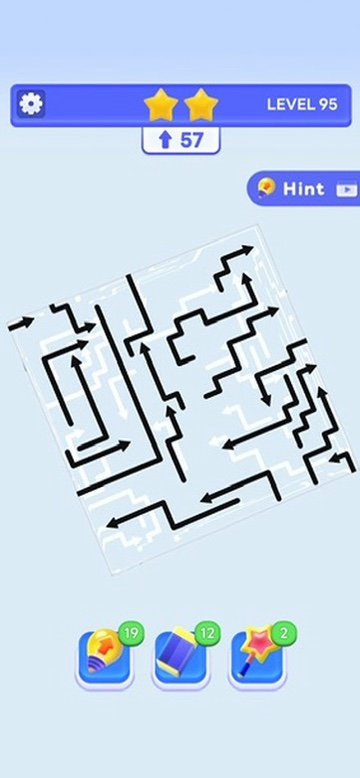
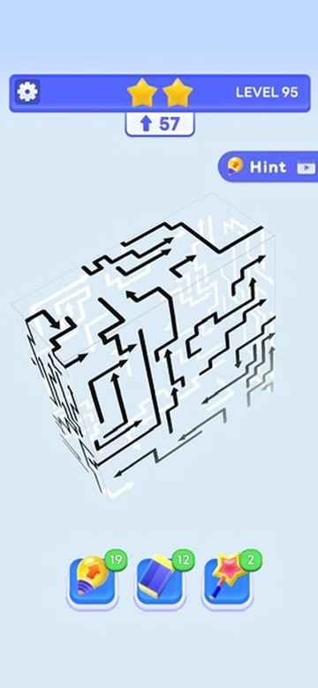
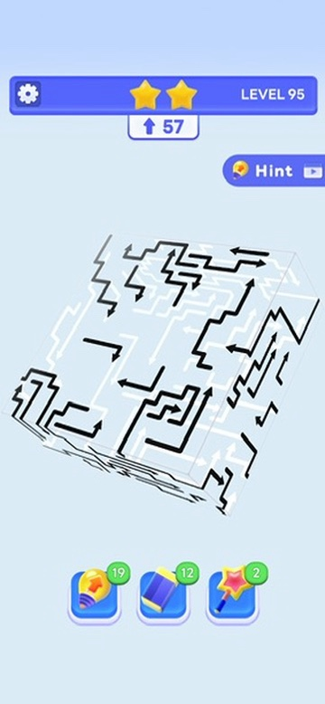

# Arrow puzzle references

These locally preserved screenshots are visual references for the planned web 3D arrow puzzle game. They are not runtime art and do not define approved game requirements. The surrounding screenshot UI is reference context only.

## Preserved images

### Reference 01

- Original basename: `4A41E034-9259-4A42-AF10-E5AA4FBA8C94_4_5005_c.jpeg`
- Dimensions: 360 × 778 px
- SHA-256: `7eb364a2760c519a524a36b76745c8972b8dcdab85873a5201fcee77099c73c1`

### Reference 02

- Original basename: `734A249B-DE1D-494C-A8A3-11928741AB09_4_5005_c.jpeg`
- Dimensions: 360 × 778 px
- SHA-256: `4ae5ee7c29d492e4a27b4e16e4ae77a2081ffeb49e157aa746bb65f0c1f3f405`

### Reference 03

- Original basename: `B373AE68-D76E-4DFB-AC72-9994F885F269_4_5005_c.jpeg`
- Dimensions: 360 × 778 px
- SHA-256: `32993181386ae835512754e51b6370f4aef0a707afdefeeec1fc1766d812e613`

## Observed visual cues

- Bent, angular arrows form paths across a translucent 3D volume.
- Black arrows are prominent on the visible/front faces.
- Faint white arrows appear on rear and side faces, creating layered depth.
- The screenshots show multiple tilted perspectives of the same puzzle style, with a level HUD, hint control, and tool icons around the play area.
