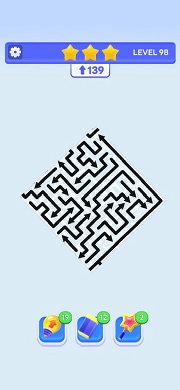
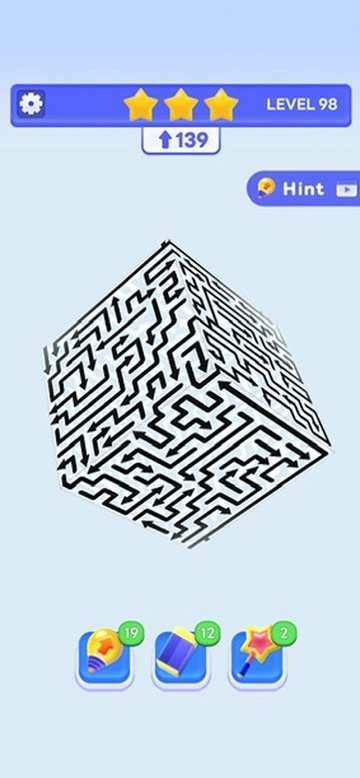
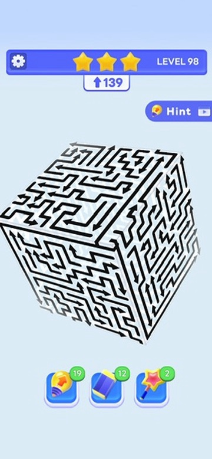
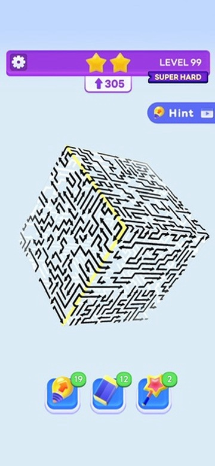

# Arrow puzzle references

These locally preserved screenshots are visual references for the current web 3D arrow puzzle game. They are not runtime art and do not define approved game requirements. The surrounding screenshot UI, including counters and tool controls, is reference context only.

## Preserved images

### Reference 01

- Original basename: `4A41E034-9259-4A42-AF10-E5AA4FBA8C94_4_5005_c.jpeg`
- Dimensions: 360 × 778 px
- SHA-256: `7eb364a2760c519a524a36b76745c8972b8dcdab85873a5201fcee77099c73c1`

### Reference 02

- Original basename: `734A249B-DE1D-494C-A8A3-11928741AB09_4_5005_c.jpeg`
- Dimensions: 360 × 778 px
- SHA-256: `4ae5ee7c29d492e4a27b4e16e4ae77a2081ffeb49e157aa746bb65f0c1f3f405`

### Reference 03

- Original basename: `B373AE68-D76E-4DFB-AC72-9994F885F269_4_5005_c.jpeg`
- Dimensions: 360 × 778 px
- SHA-256: `32993181386ae835512754e51b6370f4aef0a707afdefeeec1fc1766d812e613`

### Reference 04

- Original basename: `869D884D-AC15-4947-A05D-45DC6B8A45CD_4_5005_c.jpeg`
- Dimensions: 360 × 778 px
- SHA-256: `4075c524d618b4bc436f6a46c838729ce4deb0ccf0e719b3a9222e338866af36`
- Visual cue: Densely packed multi-bend and zigzag arrows fill a face viewed at a diamond-like angle.

### Reference 05

- Original basename: `5EDAF9D7-D2BF-4190-BC38-477A3E2BA4B3_4_5005_c.jpeg`
- Dimensions: 360 × 778 px
- SHA-256: `b35fb6a2aeaf3f65b34dddece47178a740f286785e2b2fb984f4473da485cb2f`
- Visual cue: Dense long and short hooked and zigzag paths cover several faces of a tilted cube.

### Reference 06

- Original basename: `A238DCFD-D64C-44D3-850D-D3F2E263F11B_4_5005_c.jpeg`
- Dimensions: 360 × 778 px
- SHA-256: `d62ad21dbe339f88added3f49c7751d3d2a821e1093fec707f4e30b6fee5e217`
- Visual cue: Closely packed, varied multi-bend arrows cover the visible faces of the puzzle volume.

### Reference 07

- Original basename: `B22B1022-10F1-4B03-8D96-7B808FEE41CB_4_5005_c.jpeg`
- Dimensions: 360 × 778 px
- SHA-256: `ee13207a6c3f0943452b236a1fb38f51f2308978abe6bda1dd4272354b9aa769`
- Visual cue: A yellow marking highlights an edge in the densely packed puzzle.

## Confirmed gameplay behavior

- Owner-confirmed: a moving arrow head travels around the highlighted corner onto the adjacent face instead of exiting at the edge. This is a gameplay rule confirmed by the owner, not a claim inferred from the still image.

## Observed visual cues

- Bent, angular arrows form paths across a translucent 3D volume.
- Later screenshots show denser and more varied long and short multi-bend, zigzag, and hooked paths across the visible faces.
- Black arrows are prominent on the visible/front faces.
- Faint white arrows appear on rear and side faces, creating layered depth.
- The screenshots show multiple tilted perspectives of the same puzzle style, with a level HUD, hint control, and tool icons around the play area.
