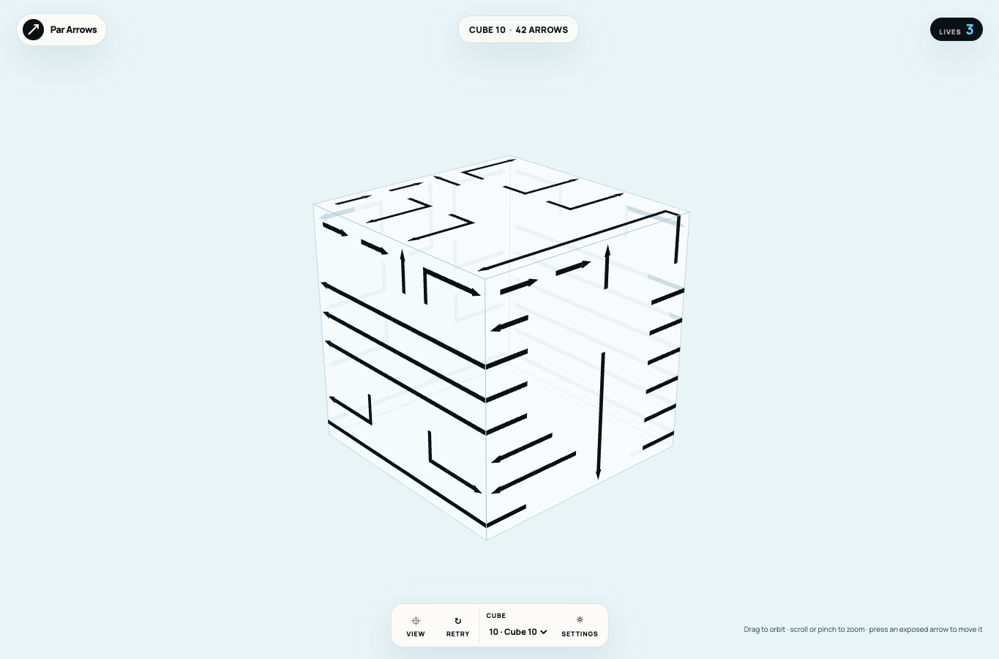
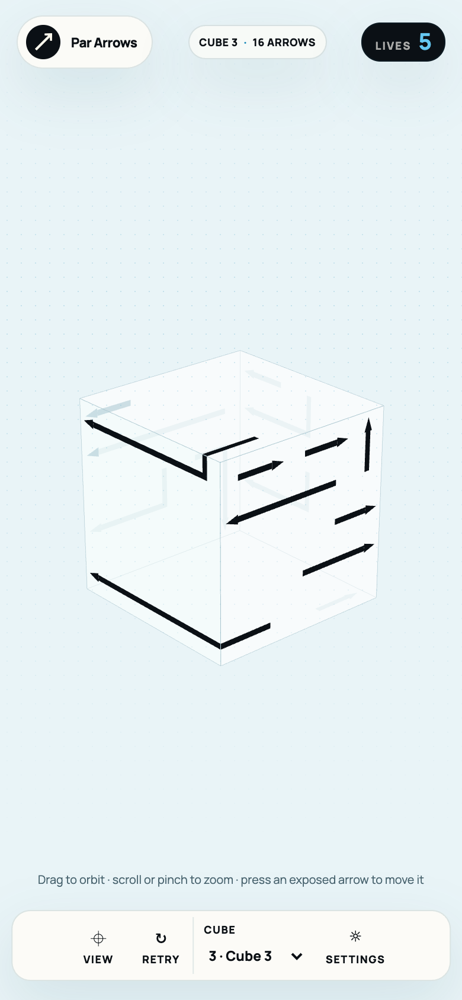
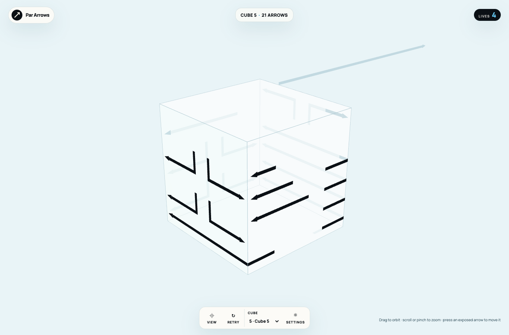
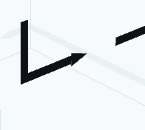
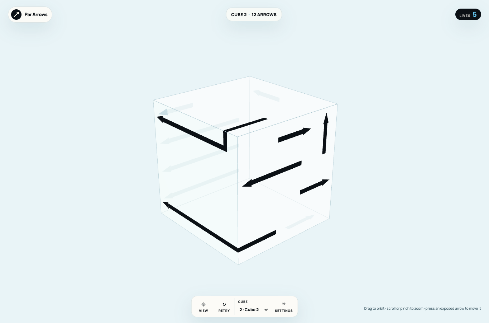

# MVP verification — 2026-09-14

Implementation is available locally. This report distinguishes verified code/browser behavior from physical-device and release qualification.

## Checks completed

- `make checkall`: format, lint, strict TypeScript, 40 unit tests / 729 assertions, and production build passed without warnings after the level-variety revision.
- `make browser-test`: headed Chrome against the production preview passed the demo, real-pointer collision and free repeats, saved red history, reload/resume, orbit/wheel, retry, interrupted final-exit unlock, zero-life failure, a three-face arrow exit, PWA assets, and emulated mobile pinch/layout checks.
- `BROWSER_ENGINE=webkit make browser-test`: the same production flows passed in headed WebKit, with mobile touch activation and portrait/landscape checks. WebKit engine testing is not physical iOS Safari testing.
- The `develop-web-game` skill's headed Playwright client completed the demo, emitted consistent JSON state, and produced an inspected screenshot without an error log.
- A disabled-WebGL browser probe displayed the startup explanation and Reload control.
- Pinned gitleaks and private-key scans passed. Pre-commit configuration and GitHub workflow validation passed. CI has not run remotely because no remote repository has been published.
- Terra reviewed the implementation. Its accepted drag-delta and seam-face findings were fixed and re-reviewed without new actionable findings in those corrections.

## PRD acceptance evidence

| Criterion | Evidence and current boundary |
| --- | --- |
| AC1 | Passed: level 1 has arrows on all six faces and five lives, checked by content tests and live game state. |
| AC2 | Browser-verified: mouse clicks, touch activation, drag and wheel, emulated two-pointer pinch, press/release arbitration, and viewport fitting. Physical device gestures remain to be qualified. |
| AC3 | Passed: straight/bent/multi-face content, solver replay, and a live three-face exit with inspected motion screenshot. |
| AC4 | Passed: first failure deducts one life and persists red history; repeat failures remain free; removal of a previously red arrow survives reload. |
| AC5 | Core-verified: 24 directed seam mappings, cell/tangent round trips, reverse endpoint fixture, and corrected segment-face ownership. Browser rotation remains independent of logic. |
| AC6 | Passed: zero-life failure, same-layout retry, final-arrow completion, and next-level unlocking including reload during the final exit. Final campaign uses the same controller with a terminal replay action. |
| AC7 | Passed: all ten curated cubes validate and their complete solutions replay. Content includes longer three-face routes and three-step dependencies. Life tiers are 5/4/3. Difficulty still needs owner playtesting. |
| AC8 | Partial: desktop and emulated mobile screenshots inspected; portrait and landscape cube bounds asserted. Physical hardware two generations old and measured performance qualification remain open. |
| AC9 | Passed for single active session: exact logical resume, failed history, corruption/range validation, denied writes, and content-version reset preserving unlocks. Multi-tab conflict handling and repeated context-loss qualification remain open. |
| AC10 | Partial: accessible HTML controls and reduced-motion setting implemented. Full keyboard/nonvisual spatial gameplay and formal accessibility audit are not claimed. |
| AC11 | Passed: typed edge-policy/oriented seam contracts and reverse double-endpoint fixtures exist. Yellow continuation runtime explicitly rejects unsupported policies; deferred mechanics are absent from campaign content. |
| AC12 | Passed locally: full project gate, headed production browser suites, workflow validation, and secret scans. |
| AC13 | Partial: manifest, icon assets, install affordance, standalone configuration, and browser installation guidance verified. Actual OS installation, installed-context save transfer, and physical-device relaunch remain open. |
| AC14 | Passed in headed browser: few-arrow demo shows visible blocked touch/red rebound followed by a successful exit; Start becomes available afterward; campaign begins with five lives and no failed history. |

## Inspected images

The owner-requested refinement uses flat ribbon bodies and triangular heads. Two successive 25% speed increases give current durations of 563.2 ms for exits, 473.6 ms for rebounds, and 70.4 ms for reduced-motion transitions. Demo pauses are unchanged. Geometry tests cover real off-center seam folds and fractional moving slices. Browser checks also assert visible dark arrow pixels. Both browser suites and the skill's headed client were rerun after the ribbon refinement; the latest timing-only change uses the existing project and headed Chrome checks.

## Miter correction

Bent ribbons now share the exact inner and outer endpoint vertices at same-face turns. Tests cover both turn directions on all face orientations, unchanged straight ends and face folds, and stable section indexing when motion leaves a tiny leading segment. The complete project gate, headed Chrome/WebKit flows, close-up inspection, and the skill's headed client pass. The current speed multiplier remains 1.5625.

Supplied defect reference:

Inspected repaired join in level 5 of the initial content:

## Level variety and content version 2

Level 1 and the demo are exactly preserved. Levels 2–10 use fixed route recipes with varied straight lengths, several substantial edge wraps, and a wrap crossing initially visible faces. Later levels retain bends, multiple headings, and three-arrow dependencies. Every level validates and has a complete no-mistake solution.

| Level | Arrow count | Arrow lengths in cells | Wrapped arrows |
| --- | --- | --- | --- |
| 1 | 6 | 2 | 0 |
| 2 | 12 | 2, 3, 4, 6 | 2 |
| 3 | 16 | 2, 3, 4, 5, 7 | 2 |
| 4 | 20 | 2, 3, 4, 5, 7 | 2 |
| 5 | 24 | 2, 3, 4, 5, 6, 8, 14 | 6 |
| 6 | 28 | 2, 3, 4, 5, 6, 8, 14 | 7 |
| 7 | 32 | 2, 3, 4, 5, 6, 8, 14 | 8 |
| 8 | 36 | 2, 3, 4, 5, 7, 9, 16 | 9 |
| 9 | 40 | 2, 3, 4, 5, 8, 10, 18 | 10 |
| 10 | 42 | 2, 3, 4, 5, 8, 10, 18 | 11 |

The full gate and both headed browser suites pass. Desktop level 2/10 and mobile level 3 screenshots were inspected, and a real click on a level-2 wrapped body was verified through its exit. Legacy version-1 level-1 state resumes unchanged; later-level attempts reset to the new content while preserving unlocks. An actual browser migration confirmed seven unlocked levels were retained and the update was explained in the UI.

## Remaining qualification

Use a secure preview origin and actual iOS/Android hardware for install/relaunch, storage-context behavior, gesture comfort, and performance measurements. The device matrix must include hardware two generations old. Offline play, account/cloud features, blue/green arrows, yellow-edge gameplay, and non-cube campaign content remain deferred.

The current save model is intended for one active play session. Simultaneous tabs can overwrite the active attempt; do not treat multi-tab conflict handling as shipped. No physical-device, production-deployment, or full accessibility certification follows from the local test results.
