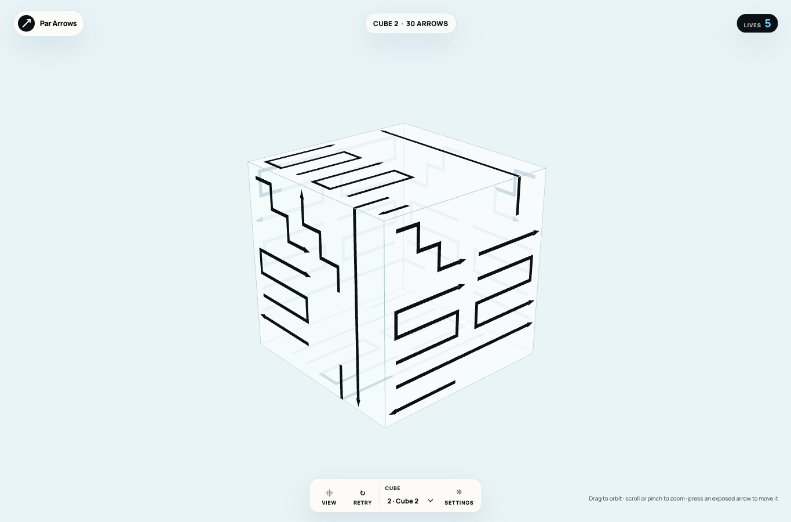
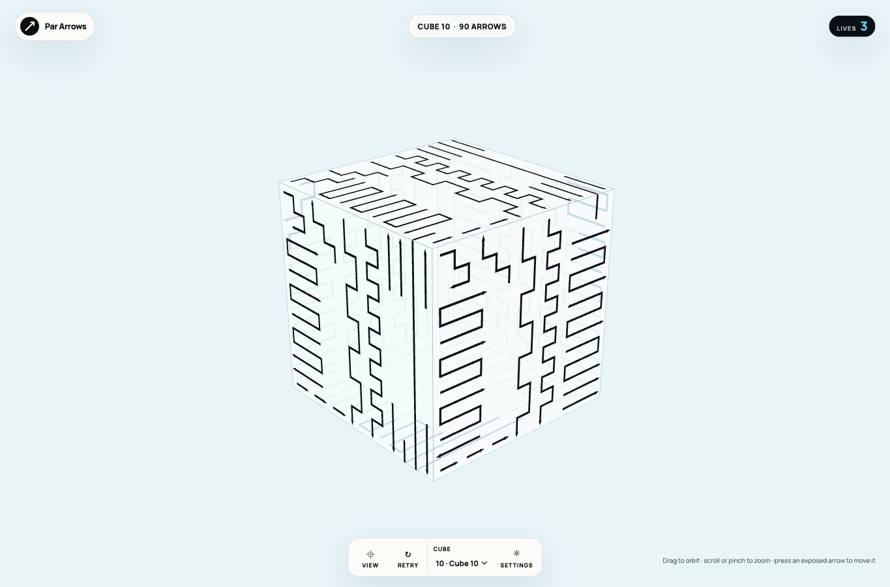
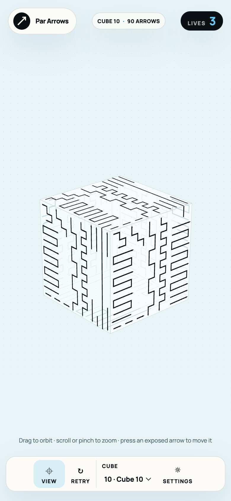

# Dense zigzag campaign verification

Verified 2026-09-14. Content version 3 keeps the introductory level and demo unchanged and replaces levels 2–10 with fixed, denser routes. Level 2 grows from 12 to 30 arrows and from 39 to 263 occupied path cells. Level 10 grows from 42 to 90 arrows and from 220 to 890 occupied cells.

## Content measurements

Multi-bend means at least three right-angle turns within faces. Wrapping over an edge is counted separately. Initially blocked arrows create removal dependencies.

| Level | Face grid | Arrows | Occupied cells | Multi-bend arrows | Maximum bends | Wrapped arrows | Initially blocked |
| --- | --- | --- | --- | --- | --- | --- | --- |
| 1 | 4 × 4 | 6 | 12 | 0 | 0 | 0 | 0 |
| 2 | 8 × 8 | 30 | 263 | 18 | 4 | 4 | 10 |
| 3 | 9 × 9 | 42 | 315 | 20 | 4 | 4 | 11 |
| 4 | 10 × 10 | 54 | 451 | 31 | 8 | 4 | 13 |
| 5 | 11 × 11 | 66 | 555 | 32 | 18 | 3 | 16 |
| 6 | 12 × 12 | 78 | 679 | 38 | 20 | 3 | 16 |
| 7 | 12 × 12 | 84 | 681 | 37 | 20 | 3 | 21 |
| 8 | 13 × 13 | 90 | 772 | 46 | 22 | 3 | 23 |
| 9 | 14 × 14 | 90 | 916 | 46 | 24 | 3 | 23 |
| 10 | 14 × 14 | 90 | 890 | 48 | 24 | 3 | 22 |

## Verification

- V1: `make checkall` passed with 46 tests and 1,221 assertions, plus formatting, lint, TypeScript, build, and icon checks. Every level validates without self-contact and replays a complete no-mistake solution. Level 1 and the demo retain their original definition hashes.
- V2: Headed Chrome and WebKit suites passed. Tests select four long visible arrows on desktop levels 2 and 10 and mobile level 10, verify the selected identity and collision/exit result, and capture motion. Rotation, wheel/pinch zoom, retry, persistence, and onboarding still pass. Chrome also passed a repeat run. Rotation checks wait for the page to handle input and retain recent pointer events if a timeout occurs.
- V3: An actual version-2 browser save with 11 remaining arrows, four lives, one failed arrow, and level 8 unlocked migrated to the new level-2 layout with 30 arrows and five lives. Level 8 stayed unlocked, onboarding stayed complete, and the UI explained that layouts had changed. Unit tests preserve exact compatible level-one state from versions 1 and 2.
- V4: The web-game skill client completed onboarding into level 1 without errors. Desktop and mobile screenshots were inspected. Terra reviewed the runtime content/decoder, renderer, and migration changes without remaining findings in scope.

## Rendering and interaction

Selection cylinders scale with the face grid, avoiding overlaps between adjacent lanes. They remain available to ray picking on a dedicated layer but are excluded from drawing. Flat ribbon/head materials use a single pass, following the [Three.js guidance for flat transparent double-sided geometry](https://threejs.org/docs/pages/Material.html#forceSinglePass).

A local headed Chrome measurement at 1365 × 900 recorded 897 draw calls and about 4.0 ms average CPU submission per reset-view render on the final level-10 board. The prior 42-arrow board recorded 656 draw calls and about 3.1 ms. These are local desktop measurements, not physical-mobile frame-rate qualification. Device qualification remains tracked separately.

## Editing

`src/content/campaign-layouts.ts` is the source of truth: each fixed route has an ID, start cell, and direction string. Runtime decoding follows those steps without placement search. Edit routes directly, then run the full gate and browser checks. Yellow continuation edges and double-ended arrows remain deferred.

## Previews

