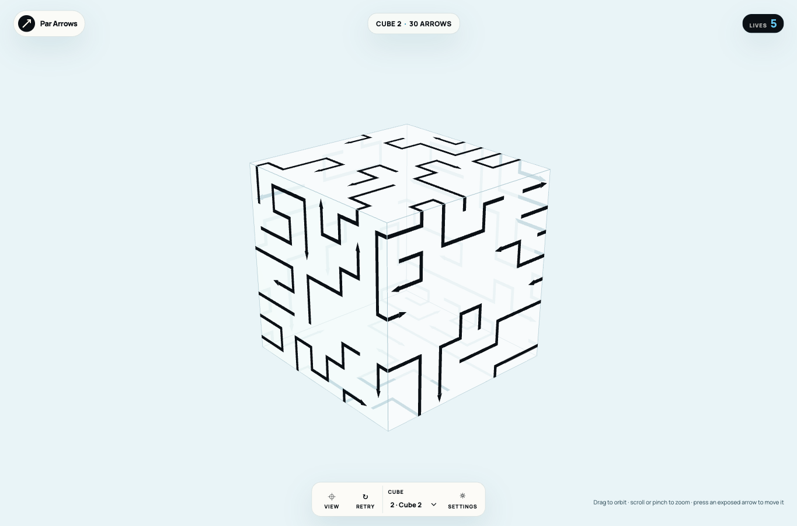
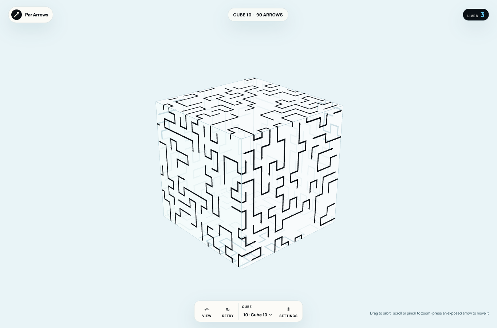
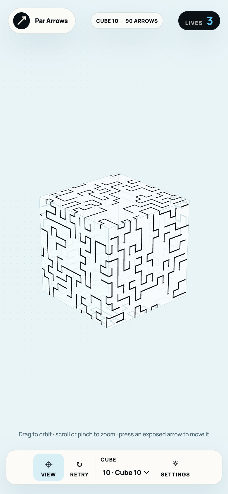

# Irregular route composition

Verified 2026-09-14. Content version 4 replaces the repeated S bands on levels 2–10 with irregular paths composed through the remaining space on the cube. Level 1 and the demo retain their original definition hashes. The visual target is documented in the [reference study](../references/arrow-complexity-study.md).

## Before and after

| Level 10 measure | Version 3 | Version 4 |
| --- | --- | --- |
| Arrows | 90 | 90 |
| Occupied cells | 890 | 882 |
| Multi-bend arrows | 48 | 68 |
| Distinct multi-bend geometry | 5 | 67 |
| Most copies of one multi-bend shape | 29 | 2 |
| Long narrow winding strips | 12 | 0 |
| Heads strictly inside faces | 14 | 55 |
| Initially blocked arrows | 22 | 46 |

Geometry comparisons unfold paths across face seams and ignore translation, rotation, reflection, and which endpoint is the head. Run lengths remain part of the shape. Moving a repeated motif onto another face does not count as new geometry.

## Campaign measurements

| Level | Arrows | Cells | Multi-bend arrows | Distinct multi-bend shapes | Maximum copies | Wrapped arrows | Interior heads | Initially blocked |
| --- | --- | --- | --- | --- | --- | --- | --- | --- |
| 2 | 30 | 270 | 19 | 18 | 2 | 19 | 13 | 9 |
| 3 | 42 | 347 | 28 | 28 | 1 | 17 | 19 | 17 |
| 4 | 54 | 446 | 29 | 29 | 1 | 26 | 24 | 26 |
| 5 | 66 | 545 | 39 | 38 | 2 | 30 | 30 | 24 |
| 6 | 78 | 654 | 48 | 46 | 2 | 31 | 46 | 38 |
| 7 | 84 | 665 | 49 | 49 | 1 | 33 | 46 | 41 |
| 8 | 90 | 778 | 52 | 52 | 1 | 41 | 55 | 40 |
| 9 | 90 | 831 | 64 | 61 | 2 | 37 | 55 | 49 |
| 10 | 90 | 882 | 68 | 67 | 2 | 37 | 55 | 46 |

Every revised level retains at least 90% of its prior occupied-cell density. Tests also require varied straight lengths, substantial wraps, three-face paths in later levels, uneven run lengths, distributed interior heads, face coverage, and meaningful blocker chains. Every level passes independent self-contact validation and a complete no-mistake solver replay.

## Authoring and reproducibility

`scripts/generate-campaign.ts` starts from an empty cube and adds arrows with clear head-exit rays. It reserves each new arrow's exit ray while growing its tail through unoccupied surface cells. Turn choices and run lengths vary using fixed seeds. Each candidate is checked with the actual movement and validation rules. The reverse placement order provides a removal solution, and the complete output is solver-checked again.

Generation is offline, bounded, and independent of its output. Runtime reads only fixed start-cell and direction-string routes through `src/content/route-codec.ts`; it performs no placement search. The generator uses the project's pinned local formatter.

Regenerate with `bun scripts/generate-campaign.ts`, inspect metrics with `bun scripts/campaign-quality.ts`, then run the full gate and browser suite. A repeated run and a run with the output temporarily absent both reproduced SHA-256 `13a370f994a5a284c443e2592d66921ac1a4f032e2c5a3d879f72ec02e631ff2`.

## Verification

- V1: `make checkall` passed with 53 tests and 1,372 assertions, plus formatting, lint, TypeScript, build, and icon checks. Shape-measurement fixtures prove normalization across rotated/mirrored copies and face seams.
- V2: Headed Chrome and WebKit suites passed dense desktop/mobile picking, long-path motion, continuous and correctly directed rotation, wheel/pinch zoom, retry, onboarding, and persistence. Desktop/mobile level-2 and level-10 output was inspected against the references. The web-game skill client completed onboarding without errors.
- V3: An actual version-3 level-2 save with 29 remaining arrows, four lives, and a failed arrow reopened on the version-4 layout with full starting lives, new route IDs, and level 8 still unlocked. The status message explained the layout update. Unit tests preserve exact compatible level-one saves from versions 1–3.
- V4: The drag trace exposed an unpressed mouse-hover event altering an active drag. A regression test reproduced the incorrect large deltas, and the input handler now ignores mouse movement without the primary button held. Browser tests can place their headed Chrome window away from the active desktop with `PAR_ARROWS_TEST_WINDOW_POSITION=-20000,-20000 make browser-test` to avoid unrelated physical-mouse interference. This option changes only the test window, not game input.

Physical-device and installed-PWA qualification remain separate open work. Yellow continuation edges and double-ended arrows are still deferred.

## Previews

