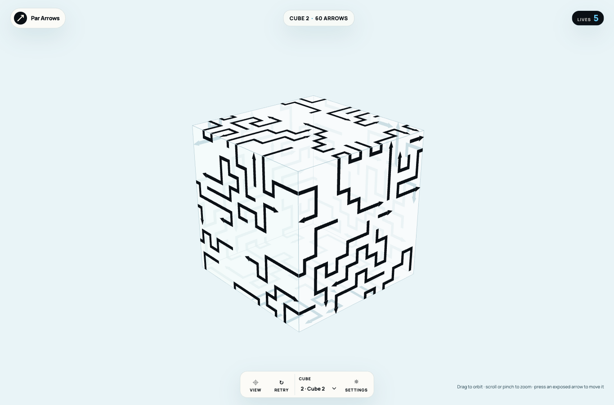
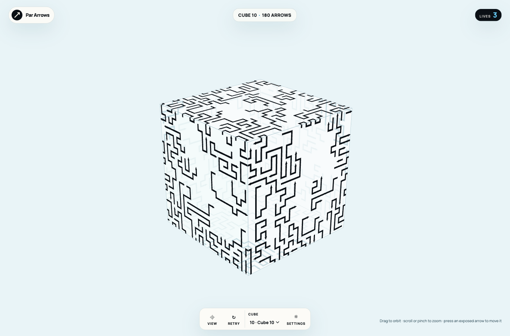
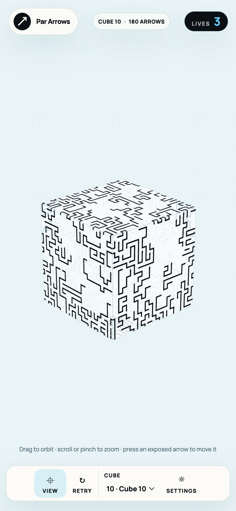

# Thicker arrows and doubled campaign counts

Verified 2026-09-14. Content version 5 doubles every level's arrow count from level 2 onward. All arrows have 20% wider ribbon shafts and triangular heads. Level 1 retains six arrows and its original layout; the demo retains its original layout. Their visual strokes receive the same thickness increase.

## Content measurements

| Level | Previous arrows | New arrows | Face grid | Occupied cells | Distinct multi-bend shapes / total | Initially blocked |
| --- | --- | --- | --- | --- | --- | --- |
| 2 | 30 | 60 | 12 × 12 | 585 | 41 / 41 | 23 |
| 3 | 42 | 84 | 13 × 13 | 750 | 55 / 56 | 39 |
| 4 | 54 | 108 | 15 × 15 | 978 | 75 / 75 | 59 |
| 5 | 66 | 132 | 16 × 16 | 1,143 | 82 / 87 | 71 |
| 6 | 78 | 156 | 18 × 18 | 1,410 | 104 / 107 | 78 |
| 7 | 84 | 168 | 18 × 18 | 1,416 | 107 / 109 | 81 |
| 8 | 90 | 180 | 20 × 20 | 1,717 | 126 / 130 | 96 |
| 9 | 90 | 180 | 21 × 21 | 1,745 | 129 / 130 | 85 |
| 10 | 90 | 180 | 22 × 22 | 1,846 | 133 / 135 | 100 |

Shape measurements account for translated, rotated, mirrored, reversed, and seam-crossing copies. The irregular route generator and repetition limits remain active. All levels validate without self-contact and replay a complete no-mistake solution. Straight lengths, substantial wraps, three-face routes, face coverage, and blocker chains remain tested.

## Thickness

The finer logical grids need independent presentation sizing. Each revised level stores `arrowScale = newGridSize / previousGridSize`. The renderer calculates `displayPitch = 2 / gridSize * arrowScale`, then uses `displayPitch * 0.15 * 1.2` for shaft width. Head width derives from that width, while head length stays at its prior size. Picking and collision geometry continue using the logical grid.

This produces a real 20% width increase at the same camera pose instead of letting the finer grid shrink the strokes. Tests check every level against its prior physical size. At the same 1365 × 900 viewport and level-one pose, dark arrow coverage increased from 2,462 to 2,965 pixels, about 20.4%, consistent with the geometric width change and rasterization.

## Verification

- V1: `make checkall` passed with 59 tests and 2,064 assertions, plus formatting, lint, TypeScript, build, and icon checks. Tests assert each exact doubled count, physical sizing, invalid-scale rejection, and unchanged level-one/demo definition hashes.
- V2: Headed Chrome and WebKit suites passed desktop/mobile selection, long-path movement, continuous rotation in the correct direction, wheel/pinch zoom, retry, onboarding, and persistence. Desktop/mobile previews and the web-game skill client's output were inspected.
- V3: A real version-4 level-2 save migrated from 29 remaining arrows and four lives to the new 60-arrow layout with five lives. Level 8 stayed unlocked, onboarding stayed complete, and the UI explained the refresh. Unit tests preserve valid level-one saves from versions 1–4 and reset later versions even when some IDs still match.
- V4: Independent generation with the output temporarily absent recreated SHA-256 `81672cdef6121c31c51212e679641d94bede8d1684028d18cd2209ac6e0eb974`. The generator remains offline and deterministic, and runtime only decodes fixed routes.

The final 180-arrow level recorded 1,946 draw calls and about 9.4 ms average CPU submission per reset-view render in local headed Chrome. These are desktop measurements; physical-device and installed-PWA qualification remain separate open work.

## Previews

